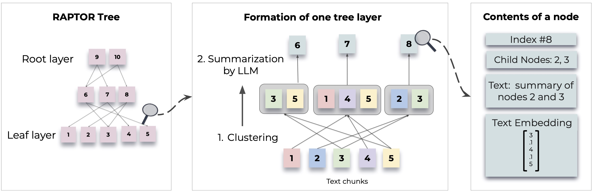

# Interact with your complex PDF that includes text, images, tables, and graphs using Raptor and Re-Ranker RAG.


## Table of Contents

- [Introduction](#introduction)
- [Re-Ranker](#Re-Ranker)
- [RAPTOR](#Recursive-Abstractive-Processing-for-Tree-Organized-Retrieval)
- [Features](#features)
- [Technologies Used](#technologies-used)
- [Setup Instructions](#setup-instructions)
- [Usage](#usage)


## Introduction

This project simplifies the process of extracting and querying information from complex PDF documents, including intricate content such as text,  tables, graphs, and images. By leveraging state-of-the-art natural language processing models and Unstructured.io for document parsing, the system employs a Cohere Reranker to enhance the accuracy and relevance of the information retrieval. The Cohere Reranker refines the initial search results to ensure that the most pertinent information is prioritized.

Following this, the system integrates RAPTOR, which introduces a novel approach to retrieval-augmented language models by constructing a recursive tree structure from documents. This method allows for more efficient and context-aware information retrieval across large texts. Additionally, Raptor Rag is utilized for retrieving semantic chunks, further refining the search results. The chatbot thus provides a user-friendly interface to interact with and retrieve detailed information from these documents.


## Re-Ranker

Before jumping into the solution, let's talk about the problem. With RAG, we are performing a semantic search across many text documents — these could be tens of thousands up to tens of billions of documents.

To ensure fast search times at scale, we typically use vector search — that is, we transform our text into vectors, place them all into a vector space, and compare their proximity to a query vector using a similarity metric like cosine similarity.

For vector search to work, we need vectors. These vectors are essentially compressions of the "meaning" behind some text into (typically) 768 or 1536-dimensional vectors. There is some information loss because we're compressing this information into a single vector.

Because of this information loss, we often see that the top three (for example) vector search documents will miss relevant information. Unfortunately, the retrieval may return relevant information below our top_k cutoff.

What do we do if relevant information at a lower position would help our LLM formulate a better response?

The solution to this issue is to maximize retrieval recall by retrieving plenty of documents and then maximize LLM recall by minimizing the number of documents that make it to the LLM. To do that, we reorder retrieved documents and keep just the most relevant for our LLM — to do that, we use reranking.

<picture>
  
</picture>


- What is Re-Ranker? 

The method of re-ranking involves a two-stage retrieval system, with re-rankers playing a crucial role in evaluating the relevance of each document to the query. RAG systems can be optimized to mitigate hallucinations and ensure dependable search outcomes by selecting the optimal reranking model.

- Power of Rerankers.

A reranking model — also known as a cross-encoder — is a type of model that, given a query and document pair, will output a similarity score. We use this score to reorder the documents by relevance to our query.


Search engineers have used rerankers in two-stage retrieval systems for a long time. In these two-stage systems, a first-stage model (an embedding model/retriever) retrieves a set of relevant documents from a larger dataset. Then, a second-stage model (the reranker) is used to rerank those documents retrieved by the first-stage model.

- Why Rerankers?

If a reranker is so much slower, why bother using them? The answer is that rerankers are much more accurate than embedding models.

For detailed methodologies and implementations, refer to the original paper:

- [Lost in the Middle: How Language Models Use Long Contexts](https://arxiv.org/pdf/2307.03172)
- [Long Document Re-ranking with Modular Re-ranker](https://arxiv.org/pdf/2205.04275)


## RAPTOR: Recursive Abstractive Processing for Tree-Organized Retrieval

<picture>
  
</picture>

**RAPTOR** introduces a novel approach to retrieval-augmented language models by constructing a recursive tree structure from documents. This allows for more efficient and context-aware information retrieval across large texts, addressing common limitations in traditional language models. 


For detailed methodologies and implementations, refer to the original paper:

- [RAPTOR: Recursive Abstractive Processing for Tree-Organized Retrieval](https://arxiv.org/abs/2401.18059)

[](https://huggingface.co/papers/2401.18059)
[](https://paperswithcode.com/sota/question-answering-on-quality?p=raptor-recursive-abstractive-processing-for)

- [Github Repo](https://github.com/parthsarthi03/raptor)
- [Youtube link](https://youtu.be/jbGchdTL7d0?si=Pfc_3vpXw8QdJP5T)

## Features

- **Table Extraction**: Identify and parse tables to retrieve structured data, making it easier to answer data-specific questions.
- **Text Extraction**: Efficiently extract and process text from PDFs, enabling accurate and comprehensive information retrieval.
- **Image Analysis**: Extract and interpret images within the PDFs to provide contextually relevant information.


## Technologies Used

- **LangChain**: Framework for building applications with language models.
- **RAG (Retrieval-Augmented Generation)**: Combines retrieval and generation for more accurate answers.
- **RAPTOR**: Constructs a recursive tree structure from documents for efficient, context-aware information retrieval.
- **Streamlit**: Framework for creating interactive web applications with Python.
- **Unstructured.io**: Tool for parsing and extracting complex content from PDFs, such as tables, graphs, and images.
- **Poetry**: Dependency management and packaging tool for Python.


## Setup Instructions

Follow these steps to set up the project on your local machine:

**1. Clone the Repository:**
- Begin by cloning the repository to your local machine:
```
https://github.com/langchain-tech/Rag-raptor-demo.git
cd Rag-raptor-demo
```

**2. Install project dependencies:**
- Use Poetry to install the dependencies defined in your pyproject.toml file. This command will also respect the versions pinned in your poetry.lock file:
```
poetry install
```
This will create a virtual environment (if one does not already exist) and install the dependencies into it.


**3. Activate the virtual environment (optional):**
- If you want to manually activate the virtual environment created by Poetry, you can do so with:
```
poetry shell
```
This step is optional because Poetry automatically manages the virtual environment for you when you run commands through it.


**4. Set Up Environment Variables:**
- Create a .env file in the root directory of your project and add the required environment variables. For example:
```
OPENAI_API_KEY=Your_OPENAI_API_KEY
POSTGRES_URL_EMBEDDINDS=YOUR_POSTGRES_URL,  like:-postgresql+psycopg://{db_user}:{db_password}@{db_host}:{db_port}/{db_name}
POSTGRES_URL=YOUR_POSTGRES_URL ,  like:- postgresql://{db_user}:{db_password}@{db_host}:{db_port}/{db_name}
```

**5. Run Data ingestion file**
- This command will insert data into your postgres database
```
python3 ingest/app.py
```


**6. Start the Application:**
- Run the application using Streamlit:
```
streamlit run app.py
```

## Examples

